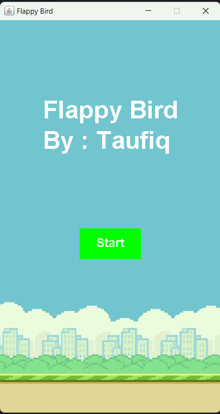
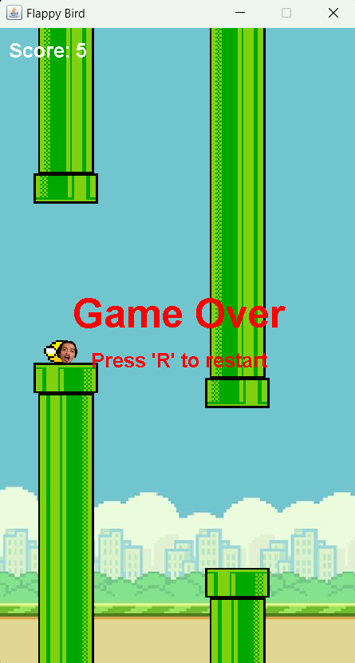

# Latihan Praktikum 7 DPBO

## Janji

Saya Ahmad Taufiq Hidayat dengan NIM 2202074 mengerjakan LP5
dalam mata kuliah DPBO untuk keberkahanNya maka saya tidak
melakukan kecurangan seperti yang telah dispesifikasikan. Aamiin.

## Data Diri

- 2202074
- Ahmad Taufiq Hidayat
- Ilmu Komputer C1'22
- Universitas Pendidikan Indonesia

## Kelas

1. `App`
   Digunakan untuk menampung objek JFrame untuk menampung frame permainan Flappy Bird

2. `Pipe`
   Memiliki atribut :

   1. PosX
   2. PosY
   3. Width
   4. Height
   5. Image
   6. VelocityX
   7. Passed

   Kelas ini digunakkan untuk menampung data dari sebuah objek pipa, sebagai rintangan permainan

3. `Player`
   Memiliki Atribut :

   1. PosX
   2. PosY
   3. Width
   4. Height
   5. Image
   6. VelocityY

   Kelas ini digunakkan untuk menampung data dari pemain, sebagai Flappy Bird

## Penjelasan

    - Saat aplikasi dibuka akan menampilkan menu utama, pengguna bisa menekan tombol start game untuk memulai permainan
    - pemain dapat menggunakan tombol spasi pada keyboard untuk mengontrol karakter berupa burung
    - jika pemain berhasil melewati pipa, maka pemain mendapat 1 skor
    - jika pemain menabrak atau menyentuh pipa, atau menyentuh bagian bawah frame, maka dinyatakan kalah, dan pemain bisa mengulang permainan   dengan menekan tombol 'R'
    - skor yang didapatkan pemain akan selalu ditampilkan selama permainan dilakukan

## Screenshot

